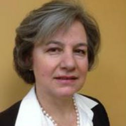
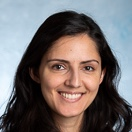
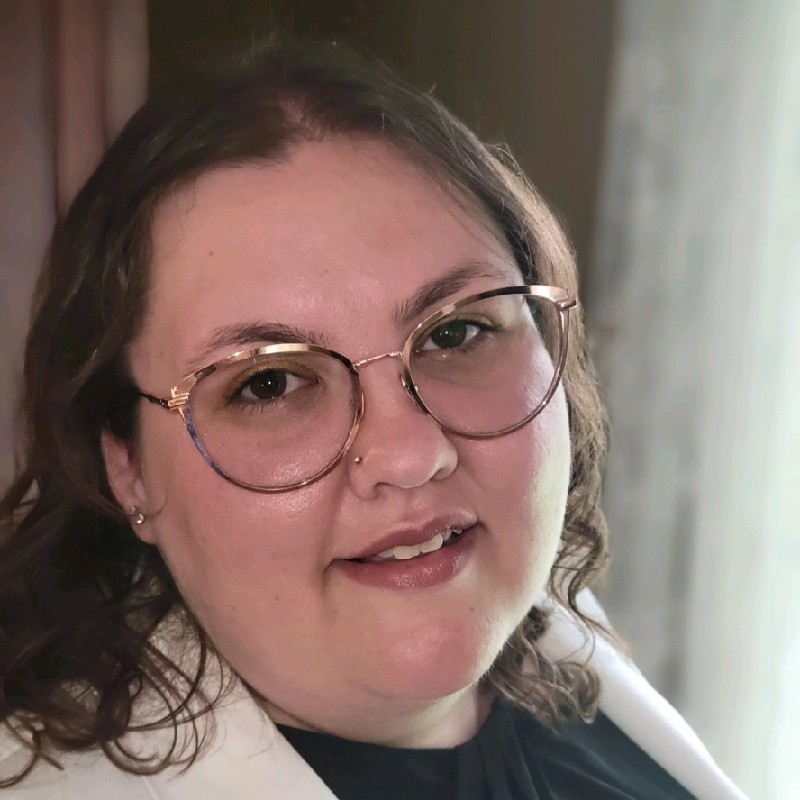

## Alessandra Bertolucci, MD, FAAO

    
    

    It's the mission of Alessandra Bertolucci, MD, of Associated Eye Physicians, to provide her patients with state-of-the-art vision care and effective treatments that best fit their lifestyle. As a Diplomate of the American Board of Ophthalmology, Dr. Bertolucci is highly qualified to provide comprehensive and retinal eye care for patients of all ages at the office of Associated Eye Physicians in northern New Jersey.
      
    Dr. Bertolucci began her medical career when she graduated with the highest honors from the Medical School of the University of Pisa, Italy. She completed her residency in ophthalmology in New York City at St. Vincent's Medical Center, where she served as chief resident. She went on to complete a fellowship in medical and surgical diseases of the retina and vitreous at the New York Eye and Ear Infirmary, also in New York City.
      
    Currently, Dr. Bertolucci is a Clinical Associate Professor at Mount Sinai University and practices at the New York Eye and Ear Infirmary as the director of the Lab of Electrophysiology of Vision.
      
    As a Fellow of the American Academy of Ophthalmology and the American Society of Retina Specialists, Dr. Bertolucci has been providing the highest standard of eye care for patients in a personalized and caring environment at Associated Eye Physicians since 2002. She has been peer-selected as a NJ Top Doctor from 2019 through 2022.
      
    Check out her profile at <a href="https://njtopdocs.com/nj-doctors/dralessandrabertolucci/"> NJ Top Docs </a>
    

## Michael Landolfi, DO

    
    

    Dr. Michael Landolfi is a graduate of Boston College in Chestnut Hill, MA. He graduated from Rowan University School of Osteopathic Medicine. He completed his residency in ophthalmology at the University of Medicine and Dentistry of New Jersey. Dr. Landolfi specializes in cataract surgery and premium intraocular lens implants, including multifocal and astigmatism-correcting lenses. He is a member of the River Drive Surgery and Laser Center and is one of the first ophthalmologists in New Jersey trained to perform Laser Cataract Surgery. Additionally, he serves as the Chief of the Department of Ophthalmology at Clara Maass MC.
      
    Dr. Landolfi is a diplomate of the American Academy of Ophthalmology and brings a wealth of knowledge and surgical expertise to Associated Eye Physicians. He takes pride in providing exceptional care to his patients, combining his extensive knowledge with the ability to deliver excellent treatment.
    

## Albert Zazzali, MD, FAAO

    
    

    Dr. Albert Zazzali received his undergraduate degree and medical degree from Rutgers, the State University of New Jersey. He completed his internship at the University of Medicine and Dentistry of New Jersey. Subsequently, he completed a residency in ophthalmology at Saint Vincent Medical Center in New York City, affiliated with New York Medical College. In his final year, he served as Chief Resident. He also underwent additional training at Richmond University Medical Center in Staten Island, NY.
      
    As a diplomate of the American Academy of Ophthalmology, Dr. Zazzali brings a wealth of knowledge and surgical expertise to Associated Eye Physicians. He takes pride in providing exceptional care to his patients in a state-of-the-art office, delivering thorough examinations and treatment plans with a combination of knowledge and empathy. He performs his cataract surgeries at Trinitas Medical Center, which is part of RWJ Barnabas Health.
    

## Jennifer A Vicente, OD FAAO

    
    

    Dr. Jennifer Vicente, OD, FAAO, graduated from The College of New Jersey in Ewing, NJ, with a Bachelor of Science degree. She earned her Doctor of Optometry degree at the New England College of Optometry in Boston, MA. She furthered her training by completing a residency in ocular disease and a fellowship in contact lenses. In addition to English, she is fluent in Portuguese and Spanish.
      
    Dr. Vicente is a valuable addition to the team, bringing her professional expertise and high ethical standards. She holds a valid license to practice optometry from the state board in New Jersey and sees patients at the Clifton and Newark office.
    

## Kaitlyn Kolzow Reda, OD

    
    

    Kaitlyn Kolzow, OD, FAAO, known as Dr. K, is a graduate of the University of Scranton, where she received a Bachelor of Science degree Summa cum Laude. She earned her Doctor of Optometry degree at the Pennsylvania College of Optometry at Salus University. She completed a residency in primary care and ocular disease. Dr. K also completed a fellowship with the American Academy of Optometry, a distinction held by less than ten percent of practicing optometrists nationwide. In the spring of 2021, Dr. K joined Associated Eye Physicians, where she currently provides comprehensive optometry services to patients of all ages at the Clifton and Pompton Lakes offices.
      
    Dr. K is dedicated to delivering current and compassionate care, always striving to practice at the highest professional and ethical standards in every encounter.
    

## Stuart M. Lonsk, OD

    
    

    Dr. Lonsk attended Wilkes University in Wilkes Barre, PA, graduating with a major in Biology. He earned his Doctor of Optometry degree from the Pennsylvania College of Optometry. 
              
    He has been caring for patients in the optometric practice that his father opened in 1946 since his graduation in 1972. 
    Dr. Lonsk served two terms on the board of directors of the New Jersey Society of Optometric Physicians. 
      
    Starting in 2024, he joined Associated Eye Physicians where he provides comprehensive optometric services to patients of all ages at the Westfield and Elizabeth offices.Dr. Lonsk is dedicated to delivering the most current and compassionate care. He practices to the highest professional and ethical standards in every encounter.
    

## Chrishonda "Chris" Mccoy, MD

    
    

    Born in Florida, Dr. McCoy attended Florida A&M University and graduated with a bachelor’s degree in chemistry. She then matriculated to Johns Hopkins,  and earned her medical degree. Following graduation, she completed a residency in Ophthalmology at the world-renown Wills Eye Hospital in Philadelphia.
      
    Dr. McCoy has now been practicing general ophthalmology for 17 years. She is excited to have joined Associated Eye Physicians. She will be providing comprehensive ocular care, for pediatric and adult patients alike. Some of the common conditions she treats are: myopia and hyperopia, dry eye, glaucoma and diabetic retinopathy.
      
    Dr. McCoy looks forward to this new chapter in her professional career and welcomes new patients.
    

## Thomas Materna, MD, FAAO (Emeritus)

    
    

    Thomas Materna, MD, FAAO after many years of serving the communities of Newark and Elizabeth service retired in December 2023.
    

